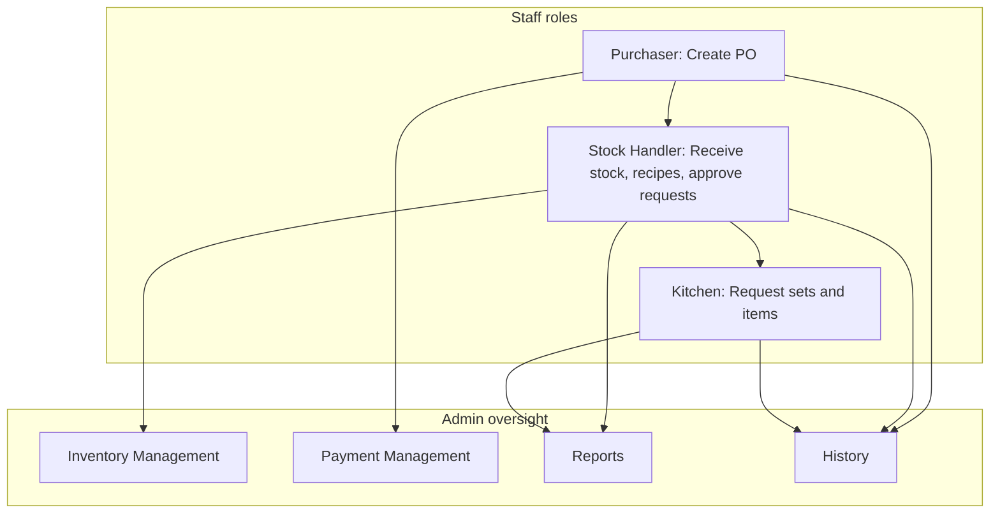

# IKEA Commissary — Administrator Manual

**For users with the `admin` role**

This guide covers admin-only screens, oversight workflows, system configuration, backups, and user management. For day-to-day tasks done by purchasers, stock handlers, and kitchen staff, see **[USER_MANUAL.md](USER_MANUAL.md)**.

---

## Table of Contents

1. [Admin Role Overview](#1-admin-role-overview)
2. [Signing In](#2-signing-in)
3. [Admin Navigation](#3-admin-navigation)
4. [Admin Dashboard](#4-admin-dashboard)
5. [Inventory Management](#5-inventory-management)
6. [Payment Management](#6-payment-management)
7. [Reports & Analytics](#7-reports--analytics)
8. [User Management](#8-user-management)
9. [System Settings](#9-system-settings)
10. [History & Audit](#10-history--audit)
11. [Operational Oversight (Other Roles)](#11-operational-oversight-other-roles)
12. [Admin Responsibilities Checklist](#12-admin-responsibilities-checklist)
13. [Technical Setup (Reference)](#13-technical-setup-reference)
14. [Troubleshooting](#14-troubleshooting)

---

## 1. Admin Role Overview

The **admin** account is for **oversight and system control**, not daily stock or kitchen work.

| You typically… | You typically do not… |
|----------------|------------------------|
| Monitor inventory health, expiry, and low stock | Package raw goods (stock handler) |
| Mark purchases as paid and attach payment receipts | Create purchase orders (purchaser) |
| Run reports and exports | Submit kitchen requests (kitchen staff) |
| Manage user accounts and system settings | Replace stock handler delivery approvals* |

\*Admins are **not** shown **Purchases**, **Inventory**, **Make Set**, or **Kitchen** menus in the sidebar. Those tasks stay with their roles. You can still review outcomes in **History**, **Reports**, and **Inventory Management**.

### Default admin login (change immediately in production)

| Field | Value |
|-------|--------|
| Username | `admin` |
| Password | `password123` |
| Email (in database) | `admin@commissary.com` |

---

## 2. Signing In

1. Open `login.php` in your browser (e.g. `http://localhost/IKEA_Commisary/login.php`).
2. Enter admin username and password.
3. After login, the header shows **Admin Dashboard** and your name.
4. Use **Sign Out** from the profile menu when finished.

**First-time setup:** Ensure MySQL is running and `database/schema.sql` has been applied. See project config in `config/database.php`.

---

## 3. Admin Navigation

When logged in as admin, the sidebar includes:

| Menu item | Page | Purpose |
|-----------|------|---------|
| **Dashboard** | `index.php` | KPIs, spending chart, alerts |
| **History** | `history.php` | Full audit log |
| **Inventory Management** | `inventory-management.php` | Stock health, expiry, disposals |
| **Payment Management** | `payments.php` | Unpaid completed purchases |
| **Reports & Analytics** | `reports.php` | Printable/exportable reports |
| **User Management** | `users.php` | Create and remove users |
| **System Settings** | `settings.php` | Config, backup, export, reset |

**Pages not in the sidebar (admin-only URL):**

- **Low Stocks:** `low-stocks.php` — focused list of items below minimum level (same data as Low Stock report, dedicated view).

**Shared with all roles:** Dashboard, History, profile menu (**Change Password**, **Sign Out**).

---

## 4. Admin Dashboard

**Path:** Dashboard

### Summary cards

Typical metrics:

- **Active Users** — accounts with status `active`
- **Total Purchases** — all purchase records
- **Total Spent** — sum of **completed** purchase amounts
- **Total Inventory Value** — quantity × price per unit across raw inventory
- **Low Stock Items** — count below minimum level
- **Pending Deliveries** — purchases awaiting stock handler approval
- **Pending Requests** — kitchen requests awaiting approval

### Total Spent Over Time chart

Line chart of spending trends (admin only). Use for monthly reviews or budget discussions.

### Alert cards

Quick links to urgent items (low stock, pending deliveries, pending kitchen requests). Click through to the relevant area or coordinate with staff.

---

## 5. Inventory Management

**Path:** Inventory Management

Read-only **oversight** table of all raw inventory with risk indicators. Stock handlers update quantities via **Raw Inventory**; admins use this page to **monitor and investigate**.

### Filters

| Filter | Options |
|--------|---------|
| **View Filter** | All Items, Low Stock, Near Expiry (≤7 days), Expired, Disposed Items |
| **Search** | Name, category, supplier |
| **Supplier** | Dropdown from purchase history |
| **Category** | Dropdown from inventory |

Click **Clear Filters** to reset.

### Table columns

- Item name, category, current stock, min stock level  
- **Shortage** — how much below minimum (if low)  
- **Supplier** — from most recent completed purchase  
- **Expiry date** — with status: OK, NEAR EXPIRY, EXPIRED  
- **Disposed quantity** — cumulative disposals  
- **Status badges** — e.g. Critical Stock, Low Stock, Warning, OK, Expired  

Items are sorted by urgency (expired first, then near expiry, then lowest stock %).

### Item detail popup

Click a row to open details:

- Full stock and pricing info  
- **Disposal history** — quantity, reason, who disposed, when  

Admins do **not** package, edit, or dispose from this page (stock handlers do that under **Inventory → Raw Inventory**).

### Expiry rules (display)

| Indicator | Meaning |
|-----------|---------|
| More than 7 days until expiry | OK |
| 1–7 days | Near expiry |
| Past expiry date | Expired |

Expiry dates come from the **latest completed purchase** for that item name.

---

## 6. Payment Management

**Path:** Payment Management

Tracks **completed** purchase orders and whether they have been **paid** in your books (separate from “delivery completed”).

### Summary cards (top)

- **Total Unpaid** — peso amount of unpaid completed orders  
- **Unpaid Batches** — count of batch orders with unpaid lines  
- **Unpaid Single Items** — count of non-batch unpaid lines  

### Filters

- Search (supplier, item names)  
- Supplier  
- Purchase type: Delivery / Personal Purchase  

### Lists

1. **Purchase Batches** — grouped orders with supplier, item count, type, date, total, payment status  
2. **Single Purchase Items** — individual completed lines  

Click a row to view full purchase/receipt details.

### Mark as Paid

For rows showing **Unpaid**:

1. Click **Mark as Paid**.  
2. In the modal:
   - **Expected Amount** — reference total  
   - **Amount Paid** * (required)  
   - **Payment Receipt** * (image or PDF, max 5MB)  
   - **Notes** (optional)  
3. Submit.

Payment status updates to **paid**. Use this when finance has settled supplier invoices, including personal purchases marked unpaid at order time.

### Relationship to purchaser workflow

| Stage | Who | Payment field |
|-------|-----|----------------|
| Order created | Purchaser | Paid or Unpaid at creation |
| Goods received | Stock handler | Delivery status → completed |
| Invoice settled | **Admin** | Mark as Paid + payment receipt |

Purchase **receipt** at order time (from purchaser) is not the same as **payment receipt** here (proof of settlement).

---

## 7. Reports & Analytics

**Path:** Reports & Analytics

### Toolbar

- **Print Report** — print-friendly view of the active tab  
- **Export CSV** — download current tab as CSV  

### Report tabs

| Tab | What it shows |
|-----|----------------|
| **Low Stock Report** | Items below minimum stock with shortage amounts |
| **Expiry Tracking** | Items with expiry dates and risk status |
| **Waste/Disposal Report** | Disposal records (quantity, reason, user, date) |
| **Purchase Analysis** | Spending patterns, suppliers, purchase history |
| **Most Consumed Items** | Usage driven by approved kitchen requests |

Use reports for:

- Weekly stock meetings  
- Waste review  
- Budget vs actual spending  
- Kitchen consumption patterns  

### Suggested review cadence

| Frequency | Reports |
|-----------|---------|
| Daily | Low Stock, Expiry (if perishable-heavy) |
| Weekly | Purchase Analysis, Disposals |
| Monthly | Most Consumed Items + Dashboard total spent |

---

## 8. User Management

**Path:** User Management

### User list

Columns: Username, Name, Email, Role, Created date, Status (Active/Inactive), Actions.

- Your own row shows **Cannot modify** (you cannot remove yourself).  
- Other users show **Remove** to delete the account permanently.

### Add a new user

1. Click **Add User**.  
2. Fill in:
   - **Username** * (unique, used at login)  
   - **Password** * (minimum 6 characters)  
   - **Full Name** *  
   - **Email** (recommended — required for email verification on password change)  
   - **Role** * — Admin, Purchaser, Stock Handler, or Kitchen Staff  
3. Click **Save**.

New users should log in and use **Change Password** (especially if email verification is enabled).

### Roles to assign

| Role | Assign to… |
|------|------------|
| **Purchaser** | Staff who order from suppliers |
| **Stock Handler** | Staff who receive goods, manage inventory, recipes, approve requests |
| **Kitchen Staff** | Production staff requesting ingredients |
| **Admin** | Managers or IT only — limit count |

### Remove a user

1. Click **Remove** on the user row.  
2. Confirm — **cannot be undone**.

Removed users cannot log in. Historical audit logs may still reference their user id/name.

### User status and password (backend support)

The system supports **Active/Inactive** status and password reset via API when editing users. The table UI currently exposes **Add User** and **Remove**; to deactivate without deleting, coordinate with your technical contact or update via database/API if needed.

**Best practice:** Prefer **inactive** over delete for former employees to preserve audit history.

---

## 9. System Settings

**Path:** System Settings

### System Configuration

Settings apply globally (saved to `system_config` table):

| Setting | Description | Typical use |
|---------|-------------|-------------|
| **Low Stock Threshold Percentage** | % below min level for alerts (default 20) | Tune sensitivity of warnings |
| **Default Min Stock Level** | Default reorder level for new items (default 10) | Standard buffer for new SKUs |
| **Enable Email Notifications** | Low-stock email on/off | Turn on after SMTP configured |
| **Backup Retention Days** | How long to keep backup files (default 30) | Housekeeping |

Change a value in the field or dropdown; it saves on change. A success notification confirms the update.

### Backup & Restore

**Create Backup**

1. Click **Create Backup**.  
2. Confirm — generates a database backup file on the server.  
3. Click **Refresh List** to see backups with filename, size, and date.

**Restore Backup**

1. Click **Restore** on a listed backup.  
2. Confirm **twice** — overwrites **all current data** with the backup.  
3. Page reloads after success.

Use before major changes or migrations. Store copies off-server for disaster recovery.

### Data Export (CSV)

Download without restoring:

| Button | Contents |
|--------|----------|
| **Export Inventory** | IDs, names, quantities, units, min levels, prices, categories |
| **Export Purchases** | Orders, suppliers, prices, delivery dates, status |
| **Export Users** | Accounts, roles, emails, status |

Files download in the browser for Excel or archival.

### Danger Zone — Reset All Data

**Reset All Data** deletes:

- All purchases  
- All kitchen requests  
- All packaged items  
- All custom recipe sets  

**Keeps:** Initial/base inventory items (per system reset logic).

Requires confirmation. Use only for:

- Training environment reset  
- Pre-go-live cleanup  

**Never** use on production without a backup.

---

## 10. History & Audit

**Path:** History (all roles; essential for admins)

Every significant action is logged: user, role, action type, details, timestamp.

### Filters

- **Search** — details, action, role  
- **Action** — filter by action category  
- **Date From / Date To**  

Use History to:

- Investigate incorrect stock changes  
- Verify who approved a delivery or request  
- Compliance and accountability reviews  

---

## 11. Operational Oversight (Other Roles)

Admins do not see operational menus in the sidebar, but staff activity affects your reports. Know who owns each step:

| If you see… | Check with… | Admin tool |
|-------------|-------------|------------|
| High unpaid total | Purchaser / Finance | Payment Management |
| Many low-stock items | Stock handler / Purchaser | Reports → Low Stock; Inventory Management |
| Expired goods | Stock handler | Reports → Expiry; Inventory Management |
| Requests stuck pending | Stock handler | Dashboard alert; History |
| Deliveries stuck pending | Stock handler | Dashboard alert; History |

Direct URL access: Admins can open pages like `purchases.php` in the browser, but **cannot** create orders or approve deliveries without the corresponding role.

---

## 12. Admin Responsibilities Checklist

### Daily

- [ ] Review Dashboard alerts (low stock, pending deliveries, pending requests)  
- [ ] Glance at **Total Unpaid** on Payment Management  

### Weekly

- [ ] Run **Low Stock** and **Expiry** reports  
- [ ] Follow up on unpaid batches older than your payment terms  
- [ ] Spot-check **History** for unusual disposals or rejections  

### Monthly

- [ ] Review **Purchase Analysis** and Dashboard spending chart  
- [ ] **Export** inventory and purchases CSV for records  
- [ ] Confirm user list matches current staff; remove leavers  
- [ ] **Create Backup** before any system changes  

### Onboarding / offboarding

- [ ] Add user with correct role and email  
- [ ] Provide temporary password; require password change  
- [ ] Remove or deactivate departed users  
- [ ] Configure SMTP if using email password verification (`PASSWORD_SETUP.md`)  

### Before go-live

- [ ] Change all default passwords  
- [ ] Set system configuration (thresholds, email)  
- [ ] Create and download a baseline backup  
- [ ] Train purchasers, stock handlers, and kitchen using **USER_MANUAL.md**  

---

## 13. Technical Setup (Reference)

Admins often coordinate IT tasks. Key project files:

| Topic | File / location |
|-------|------------------|
| Database schema & default users | `database/schema.sql` |
| Database connection | `config/database.php` |
| Password change / SMTP | `PASSWORD_SETUP.md` |
| General user guide | `USER_MANUAL.md` |

### Email notifications

Low-stock email requires:

1. `composer install` (PHPMailer)  
2. SMTP settings in `.env` or environment  
3. **Enable Email Notifications** = true in System Settings  

### Backups on hosted servers

Ensure the web server user can write the backup directory configured in the API. Test **Create Backup** after deployment.

---

## 14. Troubleshooting

### Cannot access admin pages (redirects to Dashboard)

- Confirm your account **role** is `admin` in the database or User Management.  
- Clear browser cache and log in again.

### Payment Management shows ₱0 unpaid but finance says otherwise

- Only **completed** deliveries appear. Pending deliveries are not in this list.  
- Check **payment status at purchase creation** (purchaser may have marked Paid already).

### Reports empty

- No data yet (new system) or filters/date ranges exclude records.  
- Ensure purchases are **completed** and requests **approved** for consumption reports.

### Backup or restore fails

- MySQL credentials in `config/database.php`  
- Server disk space and folder permissions  
- On shared hosting, confirm `mysqldump` / restore is allowed  

### Reset All Data clicked by mistake

- Restore from latest backup in System Settings immediately.  
- Do not enter new data until restore completes.

### User cannot change password

- User needs a valid **email** on the account.  
- SMTP must be configured (`PASSWORD_SETUP.md`).  

### Need operational how-to (purchases, packaging, requests)

See **[USER_MANUAL.md](USER_MANUAL.md)** — share the relevant section with each role.

---

## Quick Reference — Admin Menu Actions

| Page | Primary actions |
|------|-----------------|
| Dashboard | Monitor KPIs and alerts |
| Inventory Management | Filter, inspect items, view disposal history |
| Payment Management | Mark as Paid, upload payment receipt |
| Reports & Analytics | Print, Export CSV, switch tabs |
| User Management | Add User, Remove user |
| System Settings | Edit config, backup/restore, CSV export, reset data |
| History | Search and filter audit log |

---

*Document version: 1.0 — IKEA Commissary Administrator Manual*  
*Companion doc: [USER_MANUAL.md](USER_MANUAL.md)*
