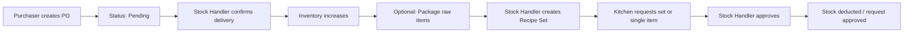

# IKEA Cakes and Snacks Commissary — User Manual

**Commissary Inventory & Recipe Management System**

This guide explains how to use the system day to day: logging in, what each role can do, and step-by-step instructions for purchases, inventory, recipes, and kitchen requests.

> **Administrators:** For admin-only features (payments, reports, users, backups, system settings), see **[ADMIN_MANUAL.md](ADMIN_MANUAL.md)**.

---

## Table of Contents

1. [What This System Does](#1-what-this-system-does)
2. [Getting Started](#2-getting-started)
3. [User Roles](#3-user-roles)
4. [Common Interface](#4-common-interface)
5. [End-to-End Workflow](#5-end-to-end-workflow)
6. [Dashboard](#6-dashboard)
7. [Purchases](#7-purchases)
8. [Inventory (Stock Handler)](#8-inventory-stock-handler)
9. [Ingredient Sets / Recipes (Make Set)](#9-ingredient-sets--recipes-make-set)
10. [Kitchen: Set Request](#10-kitchen-set-request)
11. [Kitchen Requests](#11-kitchen-requests)
12. [History](#12-history)
13. [Admin Features](#13-admin-features)
14. [Change Password](#14-change-password)
15. [Tips & Troubleshooting](#15-tips--troubleshooting)

---

## 1. What This System Does

The commissary system helps your team:

- **Track raw inventory** (quantities, reorder levels, expiry, suppliers)
- **Record purchases** and confirm deliveries into stock
- **Package raw items** into prepared/packaged units
- **Define recipe sets** (ingredient lists for kitchen products)
- **Handle kitchen requests** (recipe sets or single items) and deduct stock when approved
- **Log disposals**, payments, and activity for reporting and audit

Amounts are shown in Philippine Peso (**₱**).

---

## 2. Getting Started

### Opening the system

1. Start your web server (e.g. XAMPP: Apache + MySQL).
2. Open a browser and go to your site URL, for example:
   - Local: `http://localhost/IKEA_Commisary/login.php`
3. Sign in with the username and password provided by your administrator.

### Default demo accounts (change passwords in production)

| Role | Username | Default password |
|------|----------|------------------|
| Admin | `admin` | `password123` |
| Purchaser | `purchaser` | `password123` |
| Stock Handler | `stock_handler` | `password123` |
| Kitchen Staff | `kitchen_staff` | `password123` |

> **Security:** Change default passwords after first login. Admins can reset passwords when creating users.

### Signing out

Click your **name/avatar** (top right) → **Sign Out**.

---

## 3. User Roles

Each role sees only the menu items they need.

| Role | Main responsibility | Menu highlights |
|------|---------------------|-----------------|
| **Purchaser** | Create purchase orders, upload receipts | Dashboard, Purchases, History |
| **Stock Handler** | Receive deliveries, manage stock, recipes, approve kitchen requests | Dashboard, Purchases, Inventory, Make Set, Kitchen Requests, History |
| **Kitchen Staff** | Request ingredients/recipes for production | Dashboard, Set Request, Kitchen Requests, History |
| **Admin** | Oversight: users, payments, reports, settings, full inventory view | All of the above plus Inventory Management, Payment Management, Reports, User Management, System Settings |

---

## 4. Common Interface

### Sidebar navigation

- Use the **left sidebar** to move between pages.
- On phones/tablets, tap the **menu (☰)** icon to open the sidebar; tap outside or a link to close it.
- The active page is highlighted in blue.

### Header

- **Page title** — role-specific (e.g. “Inventory Management” for stock handler).
- **Notification bell** — alerts for low stock, pending deliveries, pending/approved/rejected requests (depends on role).
- **User menu** — Change Password, Sign Out.

### Modals and confirmations

Many actions (create order, approve request, dispose stock) open a **popup form**. Confirm destructive actions when prompted.

### Status colors (general)

- **Pending** — yellow / awaiting action  
- **Completed / Approved** — green  
- **Rejected / Cancelled** — red  

---

## 5. End-to-End Workflow

Typical flow from buying ingredients to kitchen use:

**In short:**

1. **Purchaser** logs a batch purchase (with receipt).
2. **Stock handler** reviews delivery and approves (full or partial quantities).
3. Items appear in **Raw Inventory** (new items are created automatically if needed).
4. **Stock handler** may **package** items or define **Make Set** recipes.
5. **Kitchen** requests via **Set Request** (cart) and/or **Kitchen Requests** (single items).
6. **Stock handler** **approves** or **rejects**; approval reduces inventory.

---

## 6. Dashboard

**Who:** Everyone (content varies by role).

**Path:** Dashboard (`index.php`) — first page after login.

### What you see

- **Welcome** message with your name.
- **Summary cards**, for example:
  - Stock handler: total inventory value, low stock count, pending deliveries, pending kitchen requests.
  - Purchaser: pending deliveries.
  - Kitchen: pending requests.
  - Admin: active users, total purchases, total spent, inventory value, low stock, etc.
- **Alerts** — quick links/messages for urgent items (low stock, pending work).
- **Admin only:** chart of total spent over time.

Use the dashboard as your daily checklist before opening detailed pages.

---

## 7. Purchases

**Who:** Purchaser (create orders); Stock Handler (approve deliveries); both can view history on this page.

**Path:** **Purchases**

### 7.1 Creating a batch purchase order (Purchaser)

1. Click **+ Add Purchase** (or equivalent button).
2. Choose **Purchase Type**:
   - **Delivery** — supplier delivers to commissary.
   - **Personal Purchase** — staff bought items personally (still recorded in the system).
3. Choose **Payment Status**: **Paid** or **Unpaid** (admins track unpaid items under Payment Management).
4. In **Quick Add Item**, fill in for each line:
   - Item name, brand (optional), category
   - Quantity and **display unit** (sack, box, kg, etc.)
   - **Base unit** and **conversion ratio** (how display units convert to base units, e.g. 1 sack = 50 kg → ratio 50)
   - Expiry date (optional), **price per unit** (for one display unit)
5. Click **+ Add to List** for each product.
6. Set **Supplier** (applies to the whole batch).
7. **Upload Receipt** (required for batch orders) — image or PDF.
8. Review total and item count, then **Create Batch Order**.

Orders start with status **pending** until a stock handler confirms delivery.

### 7.2 Confirming delivery (Stock Handler)

**Single pending line:**

- Open the row or use **Approve** / **Cancel** on pending items.

**Batch orders:**

- Click **Review** on a pending batch.
- For each line, enter **actual quantity received**.
  - If you receive less than ordered, the remainder stays **pending** for a later delivery.
- Select items to confirm, then confirm the delivery.

When delivery is approved, quantities are added to inventory (and new inventory items may be created from purchase data).

### 7.3 Viewing purchase details

Click a row to see supplier, type, payment status, status, receipt, dates, and line details.

---

## 8. Inventory (Stock Handler)

**Who:** Stock Handler.

**Path:** **Inventory** → **Raw Inventory** | **Prepred Items**

> Note: The menu label “Prepred Items” refers to packaged/prepared stock derived from raw inventory.

### 8.1 Raw Inventory

View all raw items with:

- Quantity and unit (color hints: green = OK, orange = low, red = zero)
- Re-order level (minimum stock)
- Category, supplier, expiry (from latest purchase), price, status

**Search:** Use the search bar to filter by name, category, supplier, or unit.

**Actions (per row):**

| Action | Purpose |
|--------|---------|
| **Package** | Convert raw quantity into packs (see below) |
| **Edit** | Update name, quantity, unit, min level, price, category |
| **Dispose** | Remove stock with a reason (spoilage, damage, etc.) |

#### Packaging raw items

1. Click **Package** on a raw item.
2. Enter how much raw stock to use, pack size, pack unit, and number of packs.
3. Submit — raw quantity decreases; packaged records appear under **Prepred Items**.

#### Disposing stock

1. Click **Dispose**.
2. Enter quantity, reason, and optional notes.
3. Confirm — stock is reduced and logged for reports/history.

### 8.2 Prepred Items (Packaged)

Lists packaged lots: source raw item, packs created, pack size, who packaged, date. Used when kitchen requests **Per Pack** items or when recipes use packaged ingredients.

---

## 9. Ingredient Sets / Recipes (Make Set)

**Who:** Stock Handler.

**Path:** **Make Set**

Recipe sets are templates (e.g. “Chocolate Cake Mix”) made of one or more inventory or packaged ingredients. Kitchen staff request these via **Set Request**.

### Creating a recipe set

1. Click **+ Add Recipe** (or similar).
2. Enter **recipe name**, optional **description**, optional **image** (shown to kitchen).
3. **Add ingredients** (left panel):
   - **Source:** Raw Inventory or Packaged Items
   - Search and select item, quantity, and unit (or packs for packaged)
4. Add all ingredients to the list on the right.
5. Save the recipe set.

### Managing existing sets

- View cards/table of sets.
- Open **ingredients** list for a set, **edit**, or **delete** as allowed by the UI.

Kitchen sees availability hints (e.g. whether stock can fulfill the recipe).

---

## 10. Kitchen: Set Request

**Who:** Kitchen Staff only.

**Path:** **Set Request**

This page is a **catalog + shopping cart** for recipe sets.

### Requesting recipe sets

1. Browse recipe cards (image, name, availability).
2. **Tap/click a card** to add to cart; set quantity when prompted.
3. Open the **cart** (badge shows item count).
4. Adjust quantities or remove lines.
5. **Submit All** — each cart line becomes a **kitchen request** (pending until stock handler approves).

The cart is stored in your browser until you submit or clear it.

---

## 11. Kitchen Requests

**Who:** Kitchen Staff (create single-item requests); Stock Handler (approve/reject); both can view status.

**Path:** **Kitchen Requests**

### 11.1 Single-item request (Kitchen Staff)

1. Click **+ New Request**.
2. **Request Type:**
   - **Raw Item** — quantity in kg, g, L, ml, or pcs.
   - **Per Pack** — number of packaged packs.
3. Search/select the item.
4. Enter quantity (and unit for raw).
5. **Submit Request**.

### 11.2 Recipe set requests

Sets submitted from **Set Request** also appear here (and on the stock handler’s pending list), grouped by status: **Pending**, **Approved**, **Rejected**.

Cards may show **insufficient inventory** warnings before approval.

### 11.3 Approving or rejecting (Stock Handler)

For each **pending** request:

1. Review ingredients or single item details.
2. Click **Approve** — stock is deducted if enough inventory exists; status becomes **approved**.
3. Or **Reject** — no stock change; status **rejected**.

If approval fails due to low stock, the system shows which items are short.

Kitchen staff receive **notifications** when requests are approved or rejected (recent activity).

---

## 12. History

**Who:** All roles.

**Path:** **History**

Audit log of system actions: timestamp, action type, user role, and details.

**Filters:**

- Search text (details, action, role)
- Action type dropdown
- Date from / date to

Use History to trace who changed inventory, approved purchases, or processed requests.

---

## 13. Admin Features

**Who:** Admin only.

For full step-by-step admin instructions, see **[ADMIN_MANUAL.md](ADMIN_MANUAL.md)**. Summary below:

### 13.1 Inventory Management

**Path:** **Inventory Management**

Consolidated view of all raw items with supplier, expiry status (OK / near expiry / expired), disposal info, and admin actions (add/edit items, disposals) beyond the stock handler day-to-day screens.

### 13.2 Payment Management

**Path:** **Payment Management**

Track purchase orders marked **Unpaid**:

- View unpaid batches and single purchases
- Record payment / update payment status
- View receipts attached to orders

### 13.3 Reports & Analytics

**Path:** **Reports & Analytics**

Tabs typically include:

| Report | Use |
|--------|-----|
| **Low Stock** | Items below minimum levels |
| **Expiry** | Items nearing or past expiry |
| **Disposals** | Disposed quantities and reasons |
| **Purchases** | Spending and purchase history |
| **Consumption** | Usage tied to kitchen activity |

Use **Print** where available for hard copies.

### 13.4 User Management

**Path:** **User Management**

- **Add user** — username, name, email, role, initial password
- **Edit** user details or role
- **Activate / deactivate** accounts
- Users should set their own password via **Change Password** (email verification if SMTP is configured — see `PASSWORD_SETUP.md`)

### 13.5 System Settings

**Path:** **System Settings**

Configure:

- Low stock threshold percentage
- Default minimum stock level for new items
- Email notifications for low stock (on/off)
- Backup retention days
- Database **backup** create/download (if enabled on your server)

---

## 14. Change Password

**Who:** All users.

1. Click your **profile** (top right).
2. Choose **Change Password**.
3. Enter current password, new password, and confirmation.
4. If email verification is enabled, enter the code sent to your registered email.

Admins must ensure user **email** addresses are correct for verification to work.

---

## 15. Tips & Troubleshooting

### “I don’t see a menu item”

Menus are **role-based**. If you need access, ask an admin to check your user role in **User Management**.

### “Login failed”

- Check username/password (case-sensitive).
- Confirm Apache/MySQL are running and the database is installed (`database/schema.sql`).
- Account may be **inactive** — contact admin.

### “Cannot approve request”

Usually **not enough stock**. Check Raw Inventory and Prepred Items; approve after restocking or reject the request.

### “Delivery approved but quantity wrong”

Use **Review** on batch deliveries and enter **actual received** quantities; partial deliveries keep leftover quantity pending.

### “Receipt required”

Batch purchases require a receipt upload before submission.

### Notifications not updating

Refresh the page or click the bell again; notifications focus on recent pending items and last-24-hour request outcomes for kitchen staff.

### Browser cart empty on Set Request

The recipe cart uses **browser storage**. Clearing site data or switching browsers removes the cart — re-add items before submitting.

### Getting help

- **Technical setup:** database config in `config/database.php`, email in `PASSWORD_SETUP.md`
- **Daily operations:** contact your commissary **admin** or **stock handler** lead

---

## Quick Reference — Who Does What

| Task | Purchaser | Stock Handler | Kitchen | Admin |
|------|:---------:|:-------------:|:-------:|:-----:|
| Create purchase order | ✓ | | | ✓ |
| Confirm delivery | | ✓ | | ✓ |
| Manage raw/packaged inventory | | ✓ | | ✓ |
| Create recipe sets | | ✓ | | |
| Request recipe sets (cart) | | | ✓ | |
| Request single items | | | ✓ | |
| Approve/reject requests | | ✓ | | ✓ |
| View history | ✓ | ✓ | ✓ | ✓ |
| Manage users / settings / reports | | | | ✓ |
| Payment tracking | | | | ✓ |

---

*Document version: 1.0 — IKEA Commissary Inventory & Recipe Management System*
